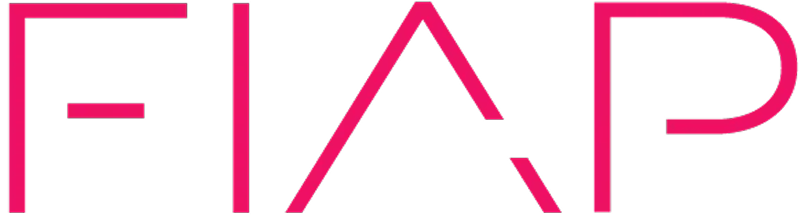

# 👋 Bem-vindos! Eu sou Leonardo Corbi

🎓 Atualmente cursando Engenharia de Software na FIAP. 💻 Apaixonado por desenvolvimento full-stack, especialmente com Next.js, Vite e Django. 🚀 Também exploro áreas como blockchain, automações, análise de dados e cybersegurança.  📫 Sinta-se à vontade para entrar em contato! 

## 🌐 Redes sociais:

 

# 💻 Stack de tecnologias:

               

<picture>
  <source media="(prefers-color-scheme: dark)" srcset="https://raw.githubusercontent.com/tobiasmeyhoefer/tobiasmeyhoefer/output/github-snake-dark.svg" />
  <source media="(prefers-color-scheme: light)" srcset="https://raw.githubusercontent.com/tobiasmeyhoefer/tobiasmeyhoefer/output/github-snake.svg" />
  
</picture>
